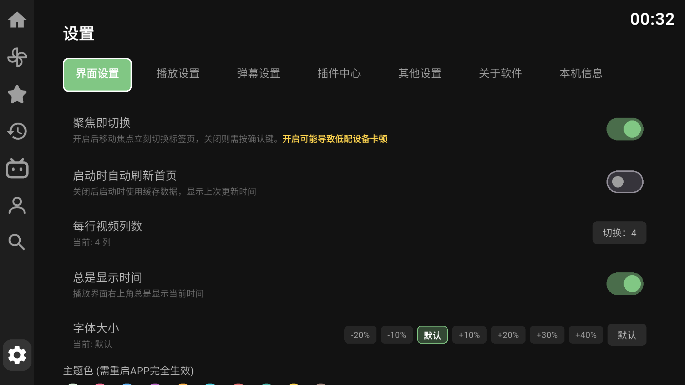
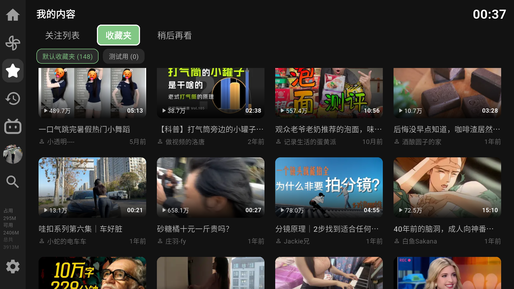

## 1) 截图预览

## 2) 更新 / 修改说明

- 登录与可用性  
  - 支持未登录使用

- 首页与导航  
  - 搜索移动到最后，方便选中推荐/热门
  - 新增「我的内容」页（关注 UP 主 / 收藏 / 稍后再看）

  - 修改遥控器按键逻辑（仍有问题，后续改进）

- 播放器与稳定性  
  - 默认行为：显示时间，开启迷你进度条，关闭自动连播
  - 全屏进度条移除圆点，加入缓存进度显示
  - 弹幕占屏比增加 `1/8` 选项
  - 视频展示列数可设置4/5/6
  - 视频数据监测面板改为纯文字实时数据（曲线功能后续加）
  - 播放初始化失败增加两层兜底（编码器/画质/兼容直链）并缩短失败等待时间
  - **播放内核**：Android 使用 **Media3 ExoPlayer**（video_player_android ^2.9），已非旧版 exoplayer2。
  - **视频编码**：支持 H.264(AVC)、H.265(HEVC)、AV1。设置 → 播放 → 视频解码器 可选「自动」或指定编码；若播放卡顿/掉帧，可改为 **H.264** 试（兼容性最好、多数设备硬解最稳）。DASH 最小缓冲已提高以减轻卡顿。
  - **编码 vs 解码**：卡顿多半是**解码**或性能问题（快速移动像帧率不足 = 解码/渲染掉帧）。「编码」是 B 站把视频压成 AV1/HEVC/H.264 流，本 app 只**选择请求哪种流**、不做编码；「解码」是电视/盒子把收到的流解成画面，硬解稳、软解易卡。播放时打开「视频数据实时监测」可看当前**流(编码)**和**解码(可能硬解/可能软解)**提示。
  - **如何确认是否硬解**：电视连 adb 后，播放视频的同时在电脑执行  
    `adb logcat -s ExoPlayer:* MediaCodec:* 2>/dev/null | head -50`  
    日志里会出现实际使用的解码器名称（如 `c2.android.av1.decoder` 多为硬解，带 `sw`/`software` 多为软解）。

- 系统与设置  
  - 新增设备信息页
  - 启动流程简化，无启动动画
  - 插件能力支持编译期开关（可构建带插件/不带插件版本）

## 3) License

本项目采用 **GPL-3.0** 协议发布。

### Upstream Notice
- 本项目开发参考/基于：[`Hyper-Beast/BiliTV`](https://github.com/Hyper-Beast/BiliTV)（仓库标注 MIT）
- 其上游来源：[`jay3-yy/BiliPai`](https://github.com/jay3-yy/BiliPai)（GPL-3.0）

鉴于上游许可证链路，本项目按 GPL-3.0 进行分发与声明。  
如有许可证归属异议，请通过 Issue 联系维护者处理。

说明：
- 视频内容、商标及相关素材版权归对应权利方所有；
- 本项目仅用于学习与技术交流，请勿用于侵权或非法用途。
