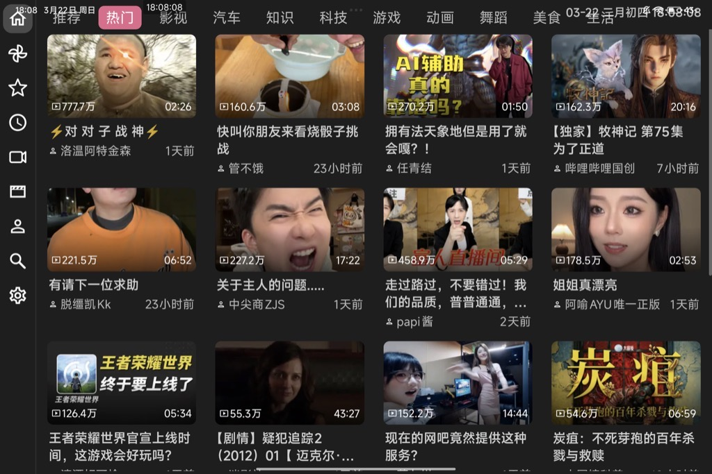
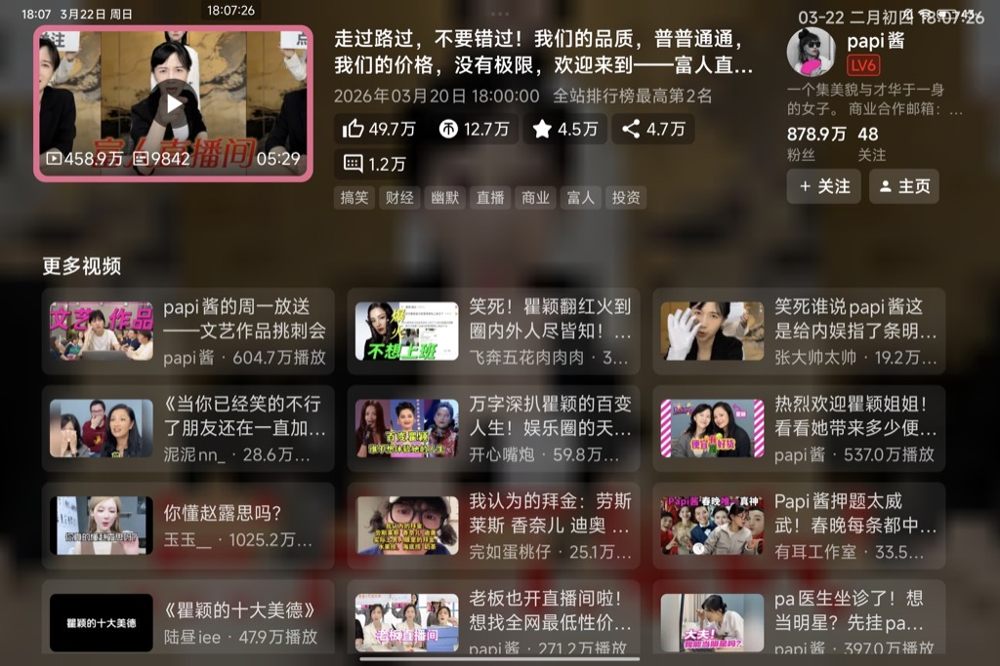
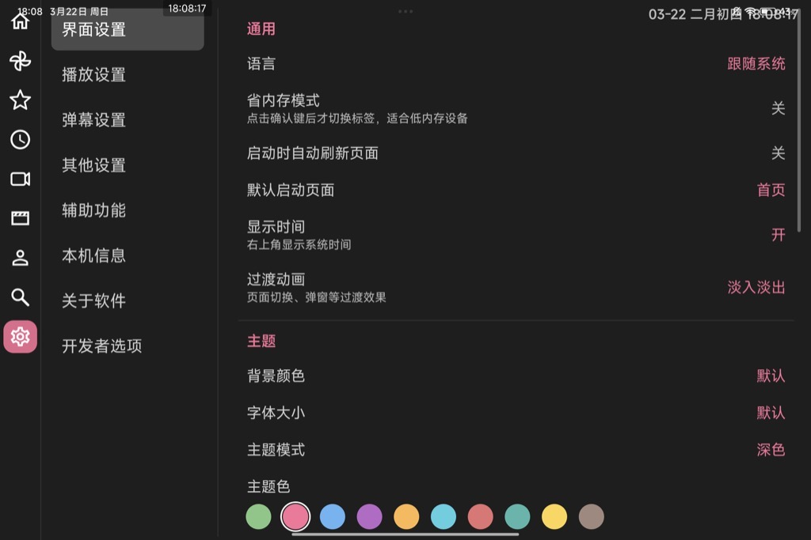
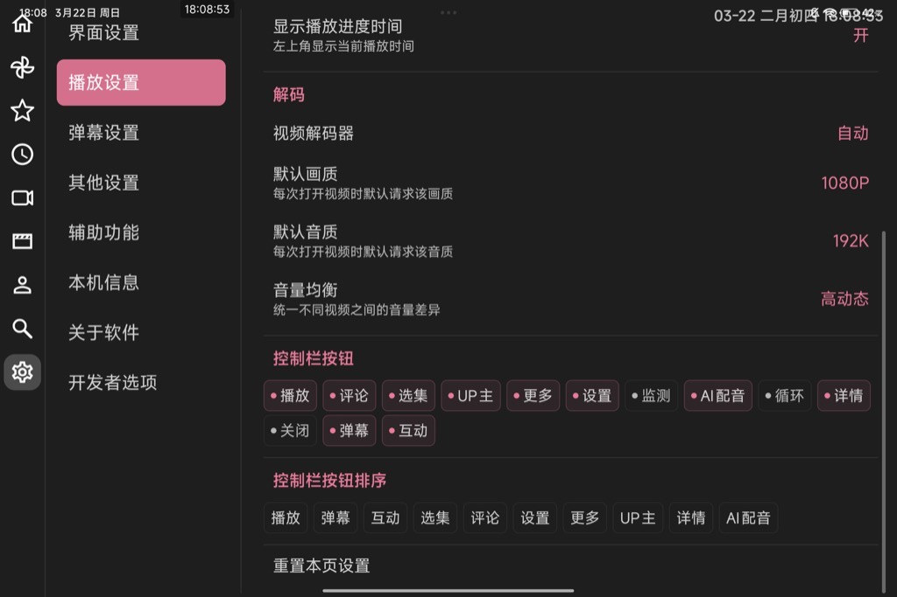

# BT-哔哩哔哩Tv客户端
BT - Bilibili TV Client

**最低支持**：  
Android 5.0（API 21）

**特色**：  
支持键鼠  
支持音量均衡  
支持AI原声翻译  
支持图文/专栏  
支持互动弹幕(投票/评分等)  
支持弹幕人像防挡  
支持查看所有评论(回复/点赞/点踩/删除)  
用户可自定义程度较高  

## 功能
- **动态**：视频投稿、图文、专栏
- **我的**：关注、追番、追剧、收藏、稍后再看
- **辅助功能**：跳恰饭，屏蔽指定弹幕
- **开发者模式**：可定制程度较高，额外彩蛋自己探索

[设置项详细说明](docs/settings-guide.md)

## 截图(取自平板截图仅供参考)

**首页热门**

**视频详情**

**界面设置**

**播放设置**

## 注
0.9.0版本后基于 Kotlin + View 完全重构，由AI主导完成  
**跳恰饭**依赖 [BilibiliSponsorBlock](https://github.com/hanydd/BilibiliSponsorBlock)（小电视空降助手）提供的 **API 与社区标注片段数据**
