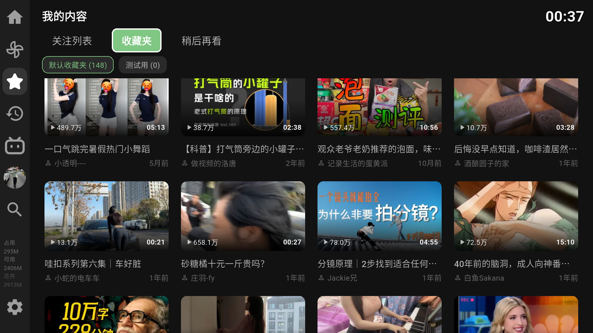

# BT-哔哩哔哩Tv客户端

**参考项目**：  
[Hyper-Beast/BiliTV](https://github.com/Hyper-Beast/BiliTV)（MIT）  
[jay3-yy/BiliPai](https://github.com/jay3-yy/BiliPai)（GPL-3.0）

**License**：  
鉴于上游许可证链路，本项目按 GPL-3.0 进行分发与声明。  

**最低支持**：  
Android 5.0（API 21）

## 重要（低内存设备注意！！！）

**标签切换策略/播放性能模式**  
设置 → 界面/播放设置 按需设置，首次安装会根据设备 RAM 自动配置

## 功能
- **动态**：视频投稿 / 图文 / 专栏，独立缓存
- **我的内容**：关注 UP 主、收藏、稍后再看
- **播放前详情页**：可选显示视频详情、评论、分享 QR
- **播放器**：播放面板选项可调节
- **开发者模式**：更多可控选项
- **交互**：支持键鼠

## 截图

