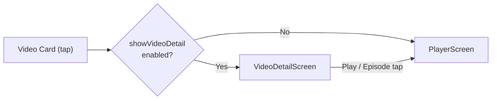

# Video Detail Page (视频详情页)

## Architecture Overview

Full-screen page inserted between video card tap and `PlayerScreen`. Controlled by setting toggle in playback settings (default: enabled).



First time entering the detail page after the setting is (re-)enabled, a toast informs the user: `"可在 设置→播放设置 关闭「播放前显示视频详情」"` (controlled by `videoDetailHintShown` in SettingsService; the flag resets when the setting is turned off).

## Data Flow

`VideoDetailScreen` receives a `Video` object, then fetches rich data in parallel:

- `PlaybackApi.getVideoInfo(bvid)` -- full video info: `stat` (like/coin/fav/reply/share counts), `pages` (分P), `ugc_season` (合集), `honor_reply` (排行榜), `tname` (分区), `pubdate`
- `InteractionApi.getUserCardInfo(ownerMid)` -- UP主 info (fans, level, sex, sign, following status)
- `PlaybackApi.getVideoTags(bvid)` -- video tags (excluding BGM type)
- Like/Coin/Favorite status checks -- delegated to `ActionButtons` internally

## Page Layout (TV Full Screen)

### Background

Video cover image as a blurred background (`ImageFilter.blur(sigmaX: 15, sigmaY: 15)`) with semi-transparent black overlay (`alpha: 0.65`).

### Section 1: Video Info Header (~38% screen height when episodes exist, ~55% otherwise)

```
 ┌──────────────┐  标题文字（1行）                          ┌──────────────┐
 │              │  发布时间 2024年01月15日 14:30:00 全站排行榜最高第28名       │   👤 UP主名称  │
 │    中号封面    │  👍1.2万 🪙300 ⭐800 📤500 💬300        │   LV6 ♂     │
 │              │  [分区] [标签1] [标签2] [标签3] ...        │   UP主简介    │
 │▶1.2万 💬300 12:34│                                      │  粉丝 关注 获赞│
 └──────────────┘                                         │   + 关注      │
                                                          └──────────────┘
```

- **Left**: Cover image (28% screen width, 16:9). Bottom has gradient overlay (`AppColors.videoCardOverlay`, same as global video cards) with stats row: `smart_display_outlined` playCount + `subtitles_outlined` danmakuCount + duration. All use unified `_buildCoverStats()` with shared style constants. Icon sizes scale with `MediaQuery.textScalerOf`. Focus shows play icon overlay.
- **Middle**: Video metadata rows
  - Row 1: Title (bold, 1 line, ellipsis)
  - Row 2: `"发布时间 年月日 时:分:秒"` + honor text (if any). All same style, no separators.
  - Row 3: `ActionButtons` (compact mode: like/coin/fav/share with counts, no text labels) + Comment button. Same row, `minHeight: 30` constraint ensures uniform background height.
  - Row 4: Video tags as individually focusable chips in a `Wrap` (tname + API tags). Click triggers search.
- **Right**: UP主 card (18% screen width, left-aligned)
  - Row: Avatar (48px circle) + Column(name bold max 2 lines, Row(level badge + sex icon))
  - Bio/sign (max 2 lines, if present)
  - Stats: 粉丝/关注/获赞/投稿
  - Follow button

### Section 2: Episodes / Collection (reversed, new first)

- Matrix grid of cards with sequence numbers and 2-line text: `"1. 标题..."` + duration
- `childAspectRatio: 3.5`, columns: 6/5/4 based on screen width
- **Reversed order**: newest episodes first (合集 only; 分P keeps original order)
- Data source: `videoInfo['ugc_season']` for 合集, `videoInfo['pages']` for 分P
- Tapping an episode card navigates to `PlayerScreen`

### Section 3: Reserved

Currently empty, Section 2 expands into this space.

### Comment Popup

- Overlay panel (not full-screen navigation), similar to `UpSpacePopup`
- Supports hot/new sorting via `CommentApi.getComments`
- `FocusScope` contains focus within popup
- Back key closes popup (handled by `PopScope`)

### Share QR Popup

- Triggered by share action button's `onShareTap` callback
- Displays QR code of video URL (`https://www.bilibili.com/video/{bvid}`)
- Uses `qr_flutter` package (`QrImageView`)
- Back key closes popup (handled by `PopScope`)
- API call `InteractionApi.shareVideo` fires in background on open

## Focus Navigation (TV Remote / D-pad)

### Zone Layout

```
        左列(封面)          中列(视频信息)              右列(UP主卡片)
Row 1                      标题 (不可聚焦)
Row 2                      发布时间+排名 (不可聚焦)
Row 3   Cover (Play)       [点赞][投币][收藏][分享] [评论]  关注按钮
Row 4                      [tag1][tag2][tag3]...
Row 5   ─────────────── Section 2: Episode Grid ───────────────
```

### Navigation Rules

All navigation uses `handleNavigationWithRepeat` to support long-press (key repeat).

**Zone transitions (Down):**
- Cover → Episodes (direct)
- Actions → Labels (position-based: finds label closest to the focused action button's x-position)
- Comment → Labels (position-based: finds label closest to comment button's x-position)
- Labels (last row) → Episodes
- UP Follow → Episodes

**Zone transitions (Up):**
- Episodes → Cover (direct, not labels)
- Labels (first row) → Actions or Comment (position-based: finds button closest to current label's x-position; sets ActionButtons' focusedIndex accordingly)

**Zone transitions (Left/Right):**
- Cover → Right → Actions (resets to index 0, no memory)
- Actions internal: left/right between like/coin/fav/share
- Actions → Right exit → Comment
- Comment → Left → Actions (sets to last button = 分享)
- Comment → Right → UP Follow
- UP Follow → Left → Comment
- Labels: left/right within **same row only**. If next/prev label is on a different row (y-position check), navigates to Cover (left) or UP Follow (right) instead.
- Labels: up/down between rows uses position-based matching (`_findLabelInAdjacentRow` compares x-coordinates to find closest label in adjacent row)

**Back key:**
- Centralized via `PopScope(canPop: false)` at root of `VideoDetailScreen`
- Priority: close Share popup → close Comment popup → `Navigator.pop()` to source
- All `_handleKeyEvent` methods return `KeyEventResult.ignored` for back/escape keys, letting `PopScope` handle them exclusively

### Focus Style

- Focused elements: `themeColor.withValues(alpha: 0.6)` background, no white border
- Unfocused: `Colors.white.withValues(alpha: 0.1)` or `Colors.black.withValues(alpha: 0.3)` depending on context
- Unfollowed button: `Colors.white.withValues(alpha: 0.15)` (no theme color)

### Focus Restoration

- After closing popups (comment/share): `_restoreFocusAfterPopup()` checks current zone — if `actions`, calls `ActionButtonsState.requestInternalFocus()` to restore ActionButtons' internal focus node; otherwise requests `_mainFocusNode`
- After returning from `PlayerScreen`: calls `ActionButtonsState.refreshStatus()` via GlobalKey, then restores `_mainFocusNode`
- After navigating to search (label click) or other screens: restores `_mainFocusNode` in `.then()` callback
- All video entry points capture `FocusManager.instance.primaryFocus` before navigation and restore it in `addPostFrameCallback` after returning

## Files

### Created

- `lib/screens/video_detail/video_detail_screen.dart` -- Main detail page (all sections, focus management, data fetching, share QR popup)
- `lib/screens/video_detail/comment_popup.dart` -- Comment popup overlay

### Modified

- `lib/services/settings_service.dart` -- `showVideoDetailBeforePlay`, `videoDetailHintShown` settings
- `lib/screens/home/settings/tabs/playback_settings.dart` -- Toggle row for detail page setting
- `lib/screens/player/widgets/action_buttons.dart` -- Compact mode with `minHeight: 30` constraint, share button, GlobalKeys for position queries, `requestInternalFocus()`, `setFocusedIndex()`, `getButtonCenter()`, `handleNavigationWithRepeat`
- `lib/widgets/tv_video_card.dart` -- Play count icon changed to `smart_display_outlined`, icon size scales with `textScalerOf`, duration font weight unified
- `lib/services/api/playback_api.dart` -- `getVideoTags(bvid)`
- `lib/services/api/interaction_api.dart` -- `shareVideo()` with `buvid3` cookie
- `lib/services/bilibili_api.dart` -- Facades for `getVideoTags`, `shareVideo`
- `lib/screens/home/home_tab.dart` -- Conditional navigation to detail page, focus restore
- `lib/screens/home/up_space_popup.dart` -- Conditional navigation, focus restore
- `lib/screens/home/search/search_results_view.dart` -- Conditional navigation, focus restore
- `lib/screens/home/up_space_screen.dart` -- Conditional navigation, focus restore
- `lib/screens/home/following_tab.dart` -- Conditional navigation, focus restore
- `lib/screens/home/dynamic_tab.dart` -- Conditional navigation, focus restore

### Key Patterns Reused

- **ActionButtons**: Direct reuse with `compact: true`, `showShare: true`, stat counts, exit callbacks
- **Image optimization**: All images use `ImageUrlUtils.getResizedUrl` + `memCacheWidth/Height` + `BiliCacheManager.instance`
- **Focus navigation**: `TvKeyHandler.handleNavigationWithRepeat` for all zones
- **Memory safety**: `mounted` checks on all async callbacks, comprehensive `dispose()`, `FocusScope` for popups
- **Per-toggle hint pattern**: Same as tunnel mode hint (`videoDetailHintShown` flag in SharedPreferences, resets when the setting is turned off)
